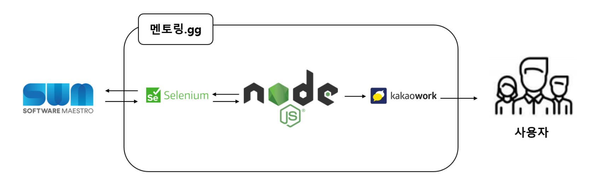

# 이력서
[](http://makeapullrequest.com)


## 소개


- 이름 : 박창환
- 취미 : 축구, 야구
- Email: korea3611@naver.com
- Blog: https://velog.io/@korea3611
- Blog: [velog.io/@korea3611](https://velog.io/@korea3611)
- GitHub: [github.com/korea3611](https://github.com/korea3611)

```
이해가 빠른 개발자가 되고싶습니다.
```

## 회사 경력
- [발란](https://www.balaan.co.kr/shop/main/index.php) (2022 ~ 현재)

## 단체 경력
- 소프트웨어 마에스트로 12기(2021 ~ 2022)
- 모두의 연구소 부스트코스 파이썬 코딩 코치(2021.7 ~ 2021.8)
---
## 업무경험

### B2B 플랫폼 개발 2022-07~2022-09
**[기술 스택]**
- 어플리케이션 API 서버 : Spring Boot 2.6.5 / JPA(Spring Data JPA) / Java 17

**[역할]**

- 보안프로퍼티 관리를 위한 AWS secret manager 연동
- 알림 이메일을 위한 AWS SES 사용
- B2B 백오피스 API 개발
    - 정규표현식 사용하여 조회 로직 성능 개선
    
### 배송 추적 api(goodsflow) 연동
**[기술 스택]**
- 어플리케이션 API 서버 : nodejs, mongoDB

**[역할]**
- goodsflow사와 협력하여 상품별 배송 추적 시스템 추가, 개선


---
## 개인 프로젝트 이력
### 🛴 BizKicks


**"킥보드 계약 플랫폼을 통한 임직원 전용 통합 공유킥보드 서비스"**
- GitHub: [https://github.com/korea3611/soma_backend](https://github.com/korea3611/soma_backend)
- 소프트웨어 마에스트로 프로젝트 - 백엔드 개발
- 기간 : 2021.06 ~ 2021.12
- 성과 : MOU 2회 체결

**[기술 스택]**

- 어플리케이션 API 서버 : Spring Boot 2.5.3 / JPA(Spring Data JPA) / Java 8
- Devops : Jenkins, GCP, K8S, docker, docker Compose, sonarQube lts
- 클라이언트 : flutter
- 디자인 / 화면설계 : figma
- 프로젝트 관리 : notion, gitlab

    
**[개발 환경 및 역할]**

- 팀명 : 킥스
- 참여인원 : 백엔드2, 프론트엔드1, 디자이너1 - 총 4명
- 기간 : 2021.06~2021.11
- 내역할:
    - Spring 을 활용한 백엔드 API 개발자
    - JWT 기반의 사용자 인증 시스템 구현
    - Docker, jenkins, k8s를 활용한 CICD 구축

**[프로젝트에 기여한 점]**

- Spring 백엔드
    1. API 구현
    2. API 문서화 - swagger를 통해 API 문서화
    3. Spring Security를 활용한 JWT기반의 사용자 인증 시스템 구현
- CICD
    1. gitlab master 브랜치에 push 될 시 jenkins에서 build
    2. jenkins에서 build 된 jar 파일을 k8s cluster 통해 수동배포
- 프로젝트 관리
    1. Gitlab을 이용하여 형상관리
    2. notion, slack 을 협업툴로 사용


**[시스템 구성도]**


**[API 명세]**

링크 : [https://github.com/korea3611/Bizkicks-Api](https://github.com/korea3611/Bizkicks-Api)

**[시연영상(Demo)]**

[https://drive.google.com/file/d/1kwcQUB19QXB7xQnbKe_qdOL33PInxs54/view?usp=sharing](https://drive.google.com/file/d/1kwcQUB19QXB7xQnbKe_qdOL33PInxs54/view?usp=sharing)


---

### 📃 맞춤법 게임(soma 해커톤 대회)

### 🕹"공공데이터를 활용한 맞춤법 게임"

**주소 :** https://github.com/swm-hackathon-4/our-awesome-game

**기술 스택**

- 어플리케이션 API 서버 :  flask
- goorm플랫폼 사용
- 클라이언트 : react
- 디자인 / 화면설계 : Adobe XD

- 자세히
    
    **[개발 환경 및 역할]**
    
    - 팀명 : 센터가 좋아요
    - 참여인원 : 백엔드3, 프론트엔드3 - 총 6명
    - 기간 : 2021.05.13~2021.05.14
    - 내역할:
        - ERD 설계
        - Flask API 서버 개발
        
    
    **[프로젝트 개요]**
    
    인터넷에는 이런 문장이 유머로 떠돕니다. ‘마마잃은 중천공’, ‘일해라 절해라 하지 마’. 누리꾼들이 올린 실화에서 따온 문장들입니다. 남아 일언 중천금이 마마잃은 중천공으로, 이래라저래라 하지 마가 일해라 절해라 하지 마로 변형된 것인데요. 틀린 맞춤법의 극단적인 예시입니다.
    
    다들 위의 문장들을 보고 웃으셨나요? 실소라도 흘리셨나요? 그렇다면 여러분은, ‘뵈요’/‘봬요’, ‘해도 되?’/‘해도 돼?’, ‘뭐에요?’/‘뭐예요?’. 둘 중 어떤 것이 옳은지 구별할 수 있으신가요?
    
    이러한 문제점을 해결하기 위해 맞춤법 문제 공공데이터를 활용하여 맞춤법 게임을 통해 맞춤법 실력을 증진시키고자 이 프로젝트를 진행하였습니다.
    
    **[프로젝트에 기여한 점]**
    
    - Flask 백엔드
        1. API 구현
        2. API 문서화 - swagger를 통해 API 문서화
        
    - 프로젝트 관리
        1. github을 이용하여 형상관리
        
    
    **[Package Diagram]**
    
    
    

---

### 📃 멘토링.gg

### ⏰"멘토링 알리미 챗봇"

**주소 :** https://github.com/korea3611/soma_chatbot

**기술 스택**

- 어플리케이션 API 서버 :  nodeJS
- goorm플랫폼 사용

- 자세히
    
    **[개발 환경 및 역할]**
    
    - 팀명 : 멘토링.gg
    - 참여인원 : 리드프로그래밍1, 크롤링2, 서버3 - 총 6명
    - 기간 : 2021.05
    - 내역할:
        - Selenium을 활용한 데이터 크롤링
        
    
    **[프로젝트 개요]**
    
    소마 활동중 멘토링을 빠르게 확인하지 못해 참여하고 싶은 멘토링을 놓치는 경우가 다수 발생함.이러한 문제점을 해결하기 위하여 멘토링이 올라오면 빠르게 알려줄수 있는 챗봇을 개발.
    
    **[프로젝트에 기여한 점]**
    
    - Selenium을 활용한 Data 크롤링
        
        
    - 프로젝트 관리
        1. github을 이용하여 형상관리
        
    
    **[시스템 구성도]**
    
    
    

## 💁🏻사회 활동
**네팔 해외봉사단 활동** (2018.10 ~ 2019.1)

## 🔫 병역

2016.09.19 ~ 2018.06.18 해병대, 보병 만기제대

---